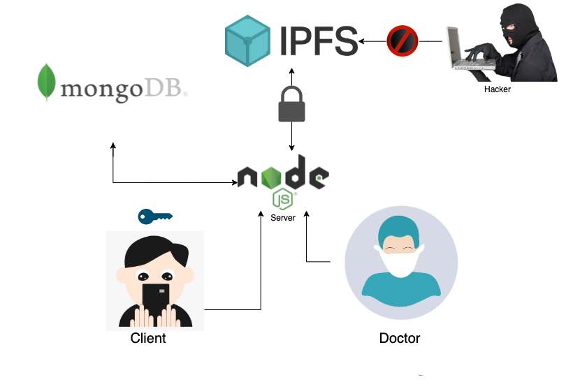

# MREX - BY COD4INE

  

#### We're building **_MREX - A DECENTRALIZED VAULT OF MEDICAL RECORDS._**

## OUR AIM

Our aim is to revolutionalize the way medical records are stored and shared between users by decentralizing the process.

## HOW WE KEEP THE DATA SECURE

  

Every file that is uploaded by the client will be _encrypted_ and will be uploaded on **_IPFS_**. The user will not have to trust any central authority with their sensitive medical records but they will be able to access them using their credentials

## SHARING REPORTS

Users will also have the option to share reports with other users who will get access to the user's key for that report, and they will be able to download the report

## TECH STACK USED
  ### FRONTEND  
  - Figma
  - React Native  
  - Redux Toolkit
  ### BACKEND
  - Node.js
  - MongoDB
  - **_IPFS_**

## OUR TEAM

  1. Aryamann Ningombam
  2. Dhruva Goyal
  3. Aditya Mohan
  4. Sitaraman S

## LINKS
  - [Product Video](https://www.youtube.com/watch?v=kmI5YqM8KrU)
  - [Figma Link](https://www.figma.com/proto/hMsvOYwCBDwBcmpQzObxT4/Mrex?page-id=1%3A19&node-id=68%3A40&viewport=241%2C48%2C0.28&scaling=scale-down&starting-point-node-id=2%3A38)
  - [Backend API](https://mrex-backend.herokuapp.com/welcome)
  - Apk Link - Yet To Come
  - Product Demo - Yet To Come

   
